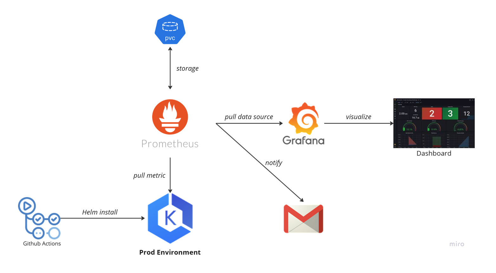

# EKS Monitoring Setup

## 🛈 Overview

This repository contains configuration files and scripts for setting up [**Prometheus**](https://prometheus.io/docs/introduction/overview/ "Prometheus") and [**Grafana**](https://grafana.com/docs/ "Grafana") for monitoring an [**EKS cluster**](https://docs.aws.amazon.com/eks/latest/userguide/what-is-eks.html "AWS EKS"). It includes YAML files for deploying monitoring components and a GitHub Actions script for automating the setup process.

## 👀 Monitoring Architecture

- The monitoring system architecture consists of the following components:
    - **Prometheus Server**: Continuously collects metrics from `node_exporter` and `kube-state-metrics` running on Kubernetes nodes and pods. It stores these metrics and evaluates them based on predefined alerting rules.
    - **Prometheus Alertmanager**: Receives alerts from Prometheus Server based on defined rules. This ensures system administrators are promptly notified of issues in the K8s cluster.
    - **Grafana**: Queries data from Prometheus and displays in on dashboards. It provides a visual representation of the Kubernetes system's performance metrics, enabling users to monitor and analyze the system effectively.

<br>

<p align="center">
    </img>
</p>

## 🧰 Components

- **This repository includes**:
    - [A Github Actions script](./.github/workflows/monitoring.yml) for automating the deployment of Prometheus & Grafana using Helm.
    - [YAML files](./alert_rules.yaml) for configuring alerts to send notifications to Telegram.
    - [A file](./prometheus-pvc.yaml) for configuring PersistentVolumeClaim for storing Prometheus & Grafana data.

## 🚀 Getting Started

### Prerequisites

- **EKS cluster**: Ensure you have an EKS cluster set up and accessible.
- **Github secrets**: Make sure you have access to the repository and the necessary secrets configured for deployment such as `aws_access_key_id` and `aws_secret_access_key`.<br>
&rarr; You can follow this [link](https://docs.github.com/en/actions/security-for-github-actions/security-guides/using-secrets-in-github-actions) to know how to use secrets in Github Actions.<br>
&rarr; You can follow this [link](https://docs.aws.amazon.com/IAM/latest/UserGuide/id_credentials_access-keys.html) to know about AWS access key.

### Setup

1. **Clone the repository**:

```bash
git clone https://github.com/NT114-O21-DACN-DevOps/class-management-EKS-monitoring.git
cd class-management-EKS-monitoring
```

2. **Configure Github Actions**

- Configure the required secrets for AWS and EKS access.
- The Github Actions workflow located in [`.github/workflows/monitoring.yml`](./.github/workflows/monitoring.yml) will handle the deployment of Prometheus and Grafana using Helm.
> :memo: The setup is finished. With this configuration, GitHub Actions will automatically deploy updates to the EKS cluster whenever changes are pushed to the repository. This ensures that your monitoring setup is always up-to-date with the latest configurations and improvements. You can monitor the progress and status of deployments directly from the Actions tab in your GitHub repository.
